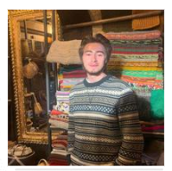

# 📌 PinAR  
**PinAR - Equipo 6**

## Entrega 0 – Presentación propuesta  

**Enlace Canva:**  
https://www.canva.com/design/DAHA1rvB9bw/tZ8cAQjkkz2FbHNFJp5Y1g/edit?utm_content=DAHA1rvB9bw&utm_campaign=designshare&utm_medium=link2&utm_source=sharebutton

---

## 👥 Nombre del equipo  

**PinAR Team**

---

## 🚀 Nombre del Proyecto  

# PinAR  

Aplicación de realidad aumentada enfocada en ayuda a las personas a guiarse en espacios cerrados desde dispositivos móviles.

---

## 👤 Integrantes  

### Carlos Daniel Guiza  

Tengo 21 años y actualmente estoy en sexto semestre de Ingeniería de Sistemas.  
Me gusta el desarrollo web, por lo que también me interesa aprender y profundizar en el área de computación móvil.

Fuera de la carrera, disfruto los videojuegos, el fútbol, ver películas y series, y compartir tiempo con mi perro. Me motiva aprender constantemente y enfrentar nuevos retos tecnológicos.

### Juan Felipe Rubiano

Tengo 20 años y curso el sexto semestre de Ingeniería de sistemas en la Javeriana.
Me intereso principalmente en temas de ciberseguridad y desarrollo web. Actualmente, trabajo en varios proyectos del último. 

Fuera de la carrera, soy apasionado por el cine, y he trabajado en varios proyectos de cortometrajes de cine análogo. 